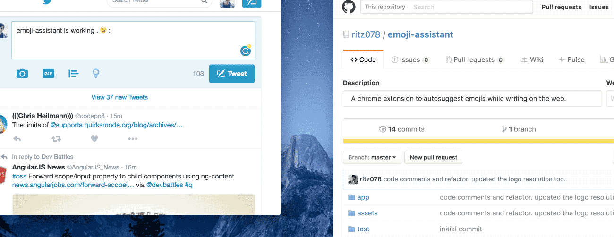

   

> A chrome extension to autosuggest emojis while writing on the web. It works in any test input fields, textarea and contenteditable divs.

### Contents
* [Screenshot](#screenshot)
* [Disabling on a domain](#disabling-on-a-domain)
* [Know issues](#known-issues)
* [Disable Smart suggestions](#disable-smart-suggestions)
* [Todo](#todo)
* [Development](#development)

### Screenshot

### Disabling on a domain
The icon of the extension works as a toggle switch. Click on it and it will enable/disable for the current domain.

**Note** : It will also refresh the page as soon as you click it.

### Known Issues
Sometimes in Single Page Applications, the extension script isn't run at a proper time when the page updates due to the [inconsistent behaviour](http://stackoverflow.com/questions/27708352/chrome-tabs-onupdated-addlistener-called-multiple-times) of `chrome.tabs.onUpdated` API. In such cases you can manually trigger the extension by using the shortcut `Cmd/Ctrl + Alt + E`. 

### Disable smart suggestions
In case you don't need smart suggestions or you feel that the suggestions are slow to come, you can disable smart suggestions by going to `Emoji assistant icon > Right Click > Options > Disable Smart Suggestions Checkbox` 

### Todo

- [ ] Better GUI for domain enable/disable
- [ ] Disable at input box level
- [x] show twitter emojis if domain is twitter.com and tweetdeck
- [ ] Find a workaround for `.onUpdated` API issue mentioned in know issues.

### Development
1. Fork and clone the repo.
2. Create a new branch.
3. run `cd emoji-assistant && npm install && gulp watch`.
4. [Load the unpacked extension](https://developer.chrome.com/extensions/getstarted#unpacked) in your browser.
5. Fix issues or add feature.
6. Open a PR.

### Credits
The logo is designed by [Ranjith Alingal](https://dribbble.com/ranjithalingal)

### License
MIT © <a href="https://twitter.com/ritz078" target="_blank">Ritesh Kumar</a>
